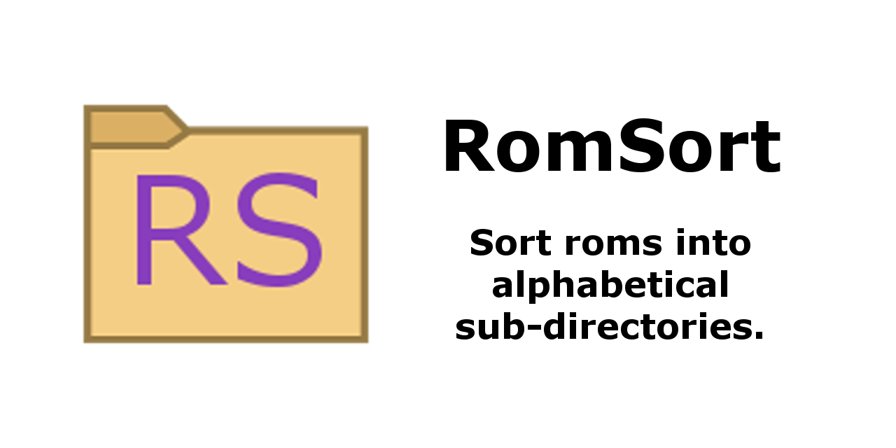
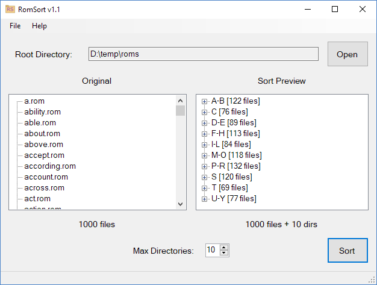

# RomSort #

RomSort is a small utility to sort a directory of files into alphabetical sub-directories.

It was designed to assist in the organization and browsing of large ROM collections, particularly on flashcarts. By setting a maximum number of sub-directories RomSort will intelligently coalesce letters together.

RomSort was written in C# and should run anywhere that supports .NET 2.0. It has officially been tested on:

* Windows XP SP3
* Windows 10
* Ubuntu 18.04

## Installation ##

### From the Microsoft Store (Windows 10 Recommended) ###

RomSort is now available on the Microsoft Store.

1. Get the latest version from https://www.microsoft.com/en-us/p/romsort/9p46qg0l6dv7
2. Run RomSort from your Start Menu

### Regular Installation (Windows XP SP3 - Windows 10, Ubuntu 18.04) ###

1. Download the latest zip file from https://github.com/jonthysell/RomSort/releases/latest
2. Extract the zip file
3. Double-click RomSort.exe

**Note:** If you're on Windows XP and don't have .NET 2.0 installed, you can get it here: https://www.microsoft.com/en-us/download/details.aspx?id=1639

**Note:** If you're on Ubuntu 18.04 and don't have the Mono Runtime installed, you can get it with: `sudo apt-get install mono-runtime libmono-system-windows-forms4.0-cil`

You should now see the RomSort window running:

## Usage ##

1. Use File > Open... or click the "Open" button and select the root directory you want to sort
2. The file hierarchy should appear under "Original" on the left side of the app
2. Set "Max Directories" at the bottom of the app to the number of alphabetical sub-directories you want
3. Verify file hierarchy that appears under "Sort Preview" on the right side of the app
4. Click the "Sort" button to perform the sort

**Note:** RomSort will create a completely new directory hierarchy under the root directory, *exactly* as shown in the preview. It will remove (delete) all other existing directories. There is no way to "undo" a sort, so make sure the preview is exactly what you want before you click the "Sort" button.

### Name Conflicts ###

Since RomSort reorganizes files into alphabetical sub-directories, it requires that each and every file starts with a unique name. Otherwise, RomSort would end up overwriting files as it moved them around.

Such name conflicts (and all of their parent directories) are flagged red in the "Original" view. You will need to rename or remove the conflicting files before sorting. You can do so via the operations available when right-clicking the conflicting item ("Rename" or "Delete") or by fixing things manually in the File Explorer. If you've made manual changes to the files on disk, be sure to run File > Refresh so RomSort can see the changes.

## Errata ##

RomSort is open-source under the MIT license.

RomSort Copyright (c) 2018-2019 Jon Thysell
